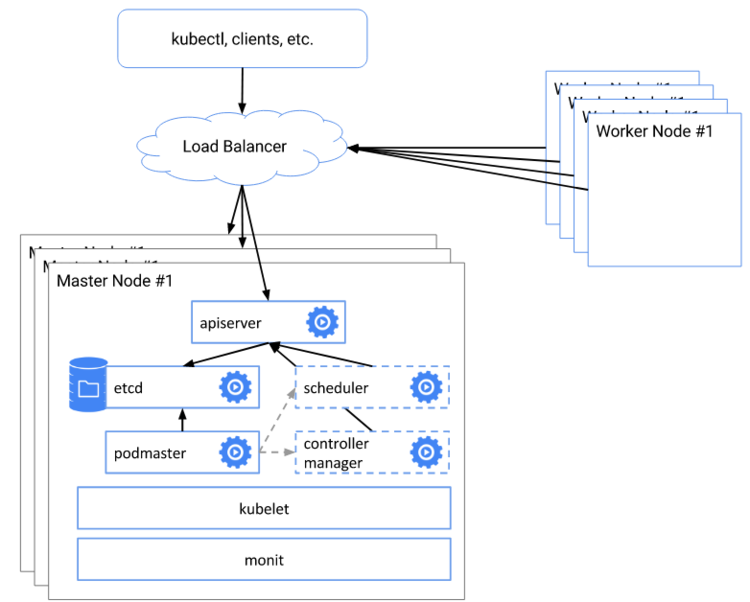

# HA Kubeadm with `Ansible` and `Vagrant` 

Prerequisites :

- [vagrant](https://www.vagrantup.com/downloads.html)
- [ansible](https://docs.ansible.com/ansible/latest/installation_guide/intro_installation.html)

# To setup just issue following command:
```
$ ansible-playbook -i hosts deploy-k8s.yaml
```
and boom, thats it!




>Note:
  >If we want to change some parts to adopt your ecosystem it can be easily done
  >just need to change IPs and names inside `Vagrantfile` and `hosts` 

# Set up a Highly Available Kubernetes Cluster using kubeadm manually
Follow this documentation to set up a highly available Kubernetes cluster using __Ubuntu 20.04 LTS__ as our masters and workers and __Centos 8__ as loadbalancer

|Role|FQDN|IP|OS|RAM|CPU|
|----|----|----|----|----|----|
|Load Balancer|k8s-lb.gwf.me|192.168.56.100|Centos 8|1G|1|
|Master|k8s-master01.gwf.me|192.168.56.101|Ubuntu 20.04|2G|2|
|Master|k8s-master02.gwf.me|192.168.56.102|Ubuntu 20.04|2G|2|
|Master|k8s-master03.gwf.me|192.168.56.103|Ubuntu 20.04|2G|2|
|Worker|k8s-wn01.gwf.me|192.168.56.201|Ubuntu 20.04|1G|1|
|Worker|k8s-wn02.gwf.me|192.168.56.202|Ubuntu 20.04|1G|1|
|Worker|k8s-wn03.gwf.me|192.168.56.203|Ubuntu 20.04|1G|1|

## Why the odd number of masters?

Consider a cluster of N members. When masters form quorum to agree on cluster state, quorum must have at least ⌊N/2⌋+1 members. Every new odd number in a cluster with M > 1 masters adds one more node of fault tolerance. Therefore, adding an extra node to an odd numbered cluster gives us nothing.

## Set up load balancer node
##### Install Haproxy
```
dnf -y update
dnf -y install haproxy
```
##### Configure haproxy
Append the below lines to **/etc/haproxy/haproxy.cfg**
```
frontend kubernetes-frontend
    bind 192.168.56.100:6443
    mode tcp
    option tcplog
    default_backend kubernetes-backend

backend kubernetes-backend
    mode tcp
    option tcp-check
    balance roundrobin
    server k8s-master01.gwf.me 192.168.56.101:6443 check fall 3 rise 2
    server k8s-master02.gwf.me 192.168.56.102:6443 check fall 3 rise 2
    server k8s-master03.gwf.me 192.168.56.103:6443 check fall 3 rise 2
```
##### Restart haproxy service
```
systemctl restart haproxy
```
## On all kubernetes nodes (master and worker nodes)
##### Disable Firewall
```
ufw disable
```
##### Disable swap
```
swapoff -a; sed -i '/swap/d' /etc/fstab
```
##### Update sysctl settings for Kubernetes networking
```
cat >>/etc/sysctl.d/kubernetes.conf<<EOF
net.bridge.bridge-nf-call-ip6tables = 1
net.bridge.bridge-nf-call-iptables = 1
EOF
sysctl --system
```
##### Install docker engine
```
{
  apt install -y apt-transport-https ca-certificates curl gnupg-agent software-properties-common
  curl -fsSL https://download.docker.com/linux/ubuntu/gpg | apt-key add -
  add-apt-repository "deb [arch=amd64] https://download.docker.com/linux/ubuntu $(lsb_release -cs) stable"
  apt update && apt install -y docker-ce containerd.io
}
```
### Kubernetes Setup
##### Add Apt repository
```
{
  curl -s https://packages.cloud.google.com/apt/doc/apt-key.gpg | apt-key add -
  echo "deb https://apt.kubernetes.io/ kubernetes-xenial main" > /etc/apt/sources.list.d/kubernetes.list
}
```
##### Install Kubernetes components
```
apt update && apt install -y kubeadm kubelet kubectl
```
## On any one of the Kubernetes master node (Eg: k8s-master01.gwf.me)
##### Initialize Kubernetes Cluster
```
kubeadm init --control-plane-endpoint="192.168.56.100:6443" --upload-certs --apiserver-advertise-address=192.168.56.101 --pod-network-cidr=172.16.0.0/16
```
Copy the commands to join other master nodes and worker nodes.
##### Deploy Calico network
```
mkdir ~/.kube && cp /etc/kubernetes/admin.conf ~/.kube/config 
kubectl  create -f https://docs.projectcalico.org/manifests/calico.yaml
```

##### Deploy metallb loadbalancer
```
kubectl apply -f https://raw.githubusercontent.com/metallb/metallb/v0.9.3/manifests/namespace.yaml
kubectl apply -f https://raw.githubusercontent.com/metallb/metallb/v0.9.3/manifests/metallb.yaml
kubectl create secret generic -n metallb-system memberlist --from-literal=secretkey="$(openssl rand -base64 128)"
```
create a file (metallbcm.yaml) with below content:
```
apiVersion: v1
kind: ConfigMap
metadata:
  namespace: metallb-system
  name: config
data:
  config: |
    address-pools:
    - name: default
      protocol: layer2
      addresses:
      - 192.168.56.144/32
```
so we now can apply the config map
```
kubectl apply -f  metallbcm.yaml
```
> * IMPORTANT: If we need to have a single IP address as metallb load balancer we need to add below annotation to every and each of service we create :
>  ``` metallb.universe.tf/allow-shared-ip: shared```

##### Create Join commands for worker and master nodes
```
* for worker nodes
kubeadm token create --print-join-command 
* for master nodes
kubeadm token create --certificate-key `kubeadm init phase upload-certs --upload-certs 2>/dev/null | awk 'NR>2 {print $1}'` --print-join-command
```

## Join master and worker nodes
copy output of join command for master which we created earlier 
ssh to every master node and paste what copied and run.
> IMPORTANT: We also need to pass --apiserver-advertise-address to the join command when you join the other master node.

copy output of join command for worker which we created earlier
ssh to every worker node and paste what copied and run.

## Access our cluster from our workstation/client
```
mkdir ~/.kube
scp root@192.168.56.101:/root/.kube/config ~/.kube/
```
It's recommended to install Helm (latest version) on our worstation machine to have a better package management.
```
curl -fsSL -o get_helm.sh https://raw.githubusercontent.com/helm/helm/master/scripts/get-helm-3
bash get_helm3.sh
```
so we now can easily install any helm-powered packages on our kubernetes, for instance we will install Nginx-Ingress:
```
helm repo add ingress-nginx https://kubernetes.github.io/ingress-nginx/
helm install nginx-ingress ingress-nginx/ingress-nginx -n kube-system
```
## Verifying the cluster
```
kubectl cluster-info
kubectl get ns
kubectl get nodes -o wide
```

Have fun!
